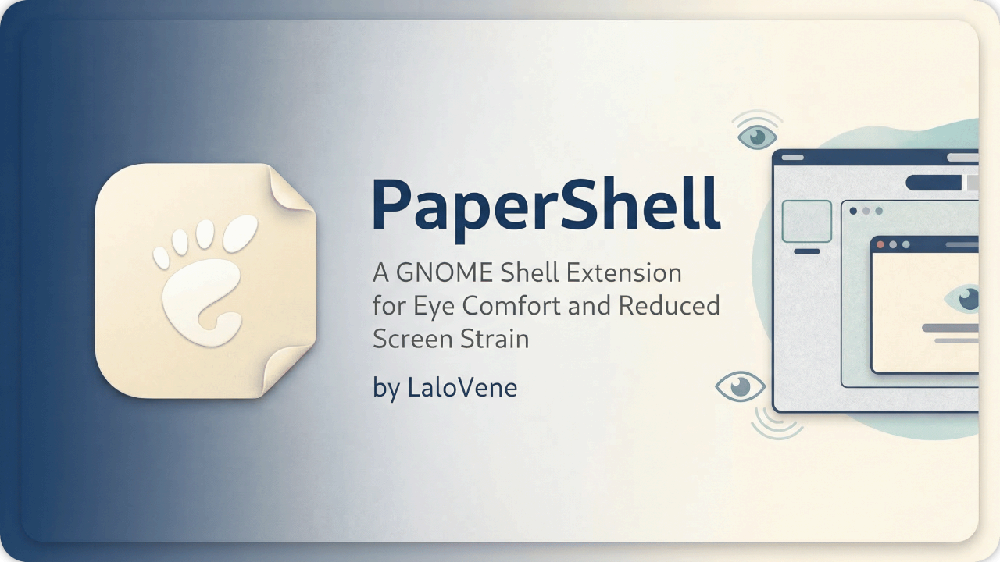
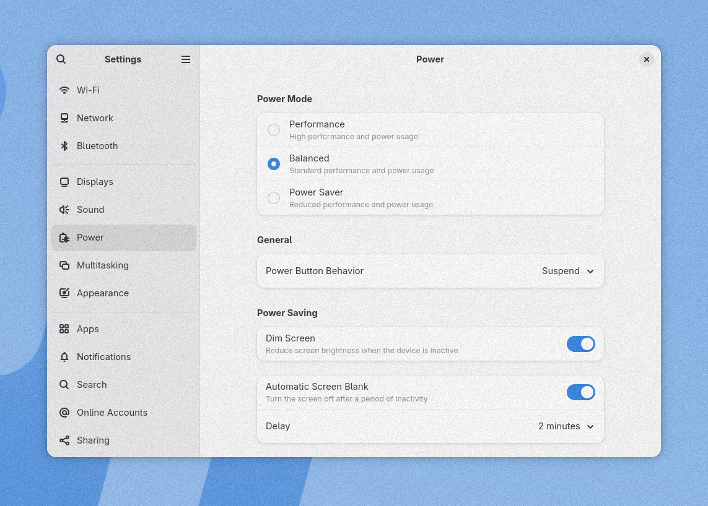
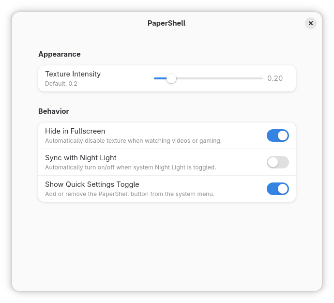

# PaperShell 📜

<div align="center">

PaperShell is a GNOME Shell extension that draws a light paper-like grain over the desktop. The effect is subtle by design: the goal is to take the edge off large flat areas of color without getting in the way of normal use.

[](https://extensions.gnome.org/extension/9524/papershell/)
[](LICENSE)

</div>

#### Before:


#### After:



## 📥 Installation

This extension uses GSettings, so the schema has to be compiled after installation.

1. Clone the repository into your local GNOME Shell extensions directory.

    ```bash
    git clone https://github.com/LaloVene/PaperShell.git ~/.local/share/gnome-shell/extensions/papershell@lalovene.github.com
    ```

2. Compile the schema.

    ```bash
    cd ~/.local/share/gnome-shell/extensions/papershell@lalovene.github.com
    glib-compile-schemas schemas/
    ```

3. Restart GNOME Shell by logging out and back in.

4. Enable the extension from the Extensions app, or run:

    ```bash
    gnome-extensions enable papershell@lalovene.github.com
    ```

## ⚙️ Configuration

Open the Extensions app and click the gear icon next to PaperShell.

Available settings:

- Texture Opacity
- Hide in Fullscreen
- Sync with Night Light
- Show Quick Settings Toggle



## 🙏 Credits & Acknowledgements

This extension was inspired by the original open-source Windows app concept.

- Original Windows app concept: [Umer-Hamaaz/Papersrc](https://github.com/Umer-Hamaaz/Papersrc)
